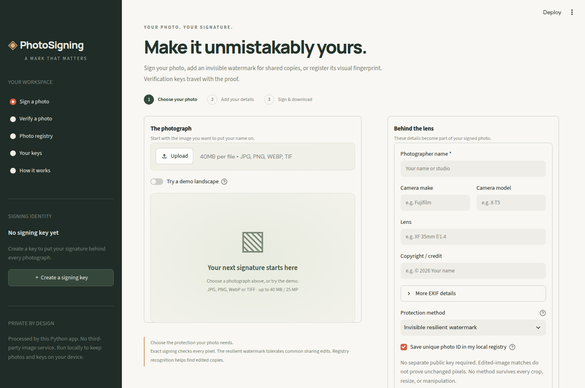

# PhotoSigning

Sign and verify photographs locally with a Python and Streamlit app. PhotoSigning
combines digital signatures, C2PA Content Credentials, invisible watermarking, and
a local photo registry to help check image integrity and recognize edited copies.

[Getting started](#getting-started) · [Usage](#usage) ·
[Documentation](#documentation) · [Contributing](CONTRIBUTING.md) · [License](LICENSE)



*Interface preview. The current protection options are described below.*

## Features

- **Exact pixel signatures:** sign photo pixels and reviewed metadata with Ed25519;
  verify whether the signed pixels are unchanged.
- **C2PA Content Credentials:** embed and inspect standard provenance manifests in
  signed PNGs, with locally generated or imported signing certificates.
- **Invisible watermarking:** use Adobe TrustMark Q with an authenticated registry
  record to recognize images after some resizing, compression, and cropping.
- **Local photo registry:** store signed records, search for matching images, and
  import or export records as JSON.
- **Portable verification:** verification keys travel with proofs and signed
  records; no separate public-key file is required for basic verification.
- **Local processing:** use your own machine without a cloud account or external
  image-processing service. Export encrypted private-key backups from the app.

PhotoSigning does not prove copyright ownership or prevent copying. Edited-image
recognition is distinct from verification that pixels are unchanged. See
[limitations and privacy](#limitations-and-privacy) before relying on a result.

## Getting started

### Requirements

- Python **3.11 or newer**.
- [uv](https://docs.astral.sh/uv/getting-started/installation/) for the recommended
  setup, or Python's `venv` and `pip`.
- Internet access to install dependencies and download TrustMark model weights on
  first use. TrustMark runs locally on the CPU; a GPU is not required.

### Install and run

```bash
git clone https://github.com/sparkingdark/photosigning.git
cd photosigning
uv sync --locked
uv run streamlit run app.py
```

Open **http://localhost:8501**. If you already have the source, run the last two
commands from its directory. `uv.lock` records the dependency versions, and the uv
configuration selects CPU builds of PyTorch and torchvision.

<details>
<summary>Install with pip instead</summary>

From the cloned repository, create and activate a virtual environment:

```bash
python -m venv .venv
source .venv/bin/activate
python -m pip install .
python -m streamlit run app.py
```

On Windows PowerShell, replace the activation command with
`.venv\Scripts\Activate.ps1`; in Command Prompt, use `.venv\Scripts\activate.bat`.
The pip route resolves dependencies from `pyproject.toml`; it does not use
`uv.lock` or uv's PyTorch index configuration.

</details>

## Usage

1. **Create a key.** Use the sidebar to create a signing key, or import one in
   **Your keys**. Download an encrypted private-key backup and keep its password
   somewhere safe; session keys can be lost when the app restarts.
2. **Choose a photo.** Upload a JPEG, PNG, WebP, or TIFF, or enable the built-in
   demo landscape. Review the photographer name and camera/EXIF details.
3. **Sign and download.** Choose a protection method, then download the result.
   Keep the original signed PNG and export its registry record as a backup.
4. **Verify.** Open **Verify a photo** and upload a signed or edited copy. The app
   reports exact signatures, C2PA results, and recovered image matches separately.
   Supply an independently trusted public key when checking a particular signer.

### Protection methods

| Method | Output | Use it to |
| --- | --- | --- |
| Exact pixel signature | Signed PNG; C2PA enabled by default | Detect changes to signed pixels in pixel-preserving copies. |
| Registry recognition only | Original file, unchanged; signed local record | Recognize registered originals and some edited copies without modifying the image. |
| Maximum resilience (default) | TrustMark watermark and exact signature in a PNG; C2PA enabled by default; registry required | Recover a short watermark tag and authenticate it against a signed, visually matching registry record after supported edits. |

Maximum resilience requires the matching registry record for verification. Back up
and share that record with verifiers as needed. The legacy DCT watermark remains
available through the Python API and verification tools; the UI uses the three
signing choices above.

See the [user guide](docs/user-guide.md) for certificate import, identity trust,
registry portability, and the meaning of each verification result.

## Limitations and privacy

- **No watermark survives every edit.** Large crops, heavy processing, overlays,
  and deliberate removal can defeat recovery. The included tests exercise specific
  transformations and do not guarantee a social platform's behavior.
- **A signature does not establish an identity.** Names, EXIF fields, and signing
  times are supplied by the signer. Local C2PA certificates are untrusted by
  default; there is no independent timestamp authority in the default workflow.
- **Run locally for private processing.** A remotely hosted Streamlit app receives
  uploaded photos and imported keys on its server. The default configuration binds
  to localhost; the app is intended for one trusted local user and should not be
  exposed as an unauthenticated public service.
- **Protect keys and records.** Private keys are never embedded in exported photos.
  The registry stores signed details and visual features, including a small grayscale
  representation, and is shared by users of the same running instance.
- **Review metadata before sharing.** Registry-only output preserves the original
  file's metadata. Existing C2PA history can include earlier metadata or thumbnails.
- **Observe input limits.** The app accepts single-frame images up to 40 MB and
  25 million pixels. The custom signature and legacy watermark formats have not
  undergone an independent security audit.

Model weights are downloaded on first use. The interface also requests optional
Google Fonts, with a local font fallback. These requests are separate from local
photo processing.

## Configuration

The local registry defaults to `.photosigning/registry.sqlite3`, which Git ignores.
Set `PHOTOSIGNING_REGISTRY` to choose another database path. The registry supports
up to 500 records; export records through the app to back them up or move them.

The Streamlit theme, localhost binding, and upload limit are configured in
[.streamlit/config.toml](.streamlit/config.toml). Keep secrets and signing keys out
of repository configuration.

## Documentation

| Guide | Contents |
| --- | --- |
| [User guide](docs/user-guide.md) | Signing workflow, C2PA certificates, identity, and registry behavior. |
| [Technical reference](docs/technical-reference.md) | Signature formats, watermark implementation, Python API example, and research references. |
| [Robustness audit](docs/robustness-audit.md) | Recorded transformation and adversarial checks, including failures. |
| [Contributing](CONTRIBUTING.md) | Development setup, tests, issue reports, and pull requests. |
| [Third-party notices](THIRD_PARTY_NOTICES.md) | Adapted source, dependency, model, and asset licensing. |
| [Publication review](docs/publishing.md) | Initial licensing review and source-publication instructions. |

## Contributing

Bug reports, documentation improvements, tests, and code contributions are welcome.
Read [CONTRIBUTING.md](CONTRIBUTING.md) for setup and submission guidance. Use
[GitHub Issues](https://github.com/sparkingdark/photosigning/issues) for bugs and
feature proposals, and discuss significant format or verification changes before
implementing them.

## License and acknowledgments

PhotoSigning is licensed under the [Apache License 2.0](LICENSE). See [NOTICE](NOTICE)
and [third-party notices](THIRD_PARTY_NOTICES.md); dependencies retain their own licenses.

The legacy image watermark is a modified Python adaptation of
[Majik Signature](https://github.com/Majikah/majik-signature), licensed under Apache-2.0.
Its [attribution and modification history](third_party/majik-signature/NOTICE.md)
are retained. PhotoSigning also uses Adobe TrustMark and the CAI C2PA Python SDK.

The maintainer reports that the code was generated using OpenAI Codex, with Majik
Signature source supplied for the credited adaptation. This is an independent
project; references to upstream projects do not imply endorsement.
